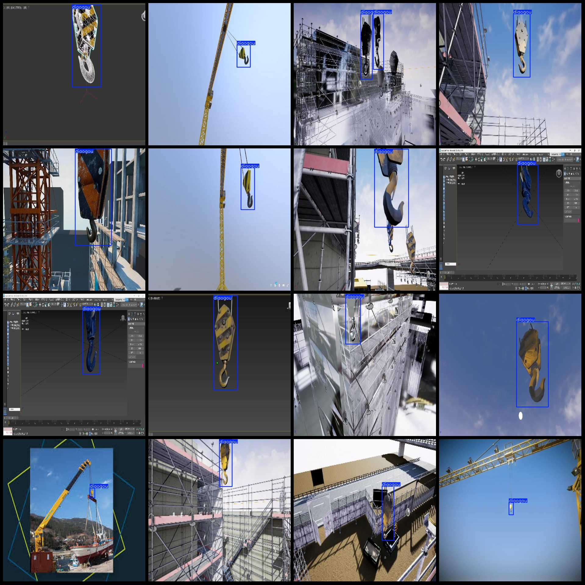
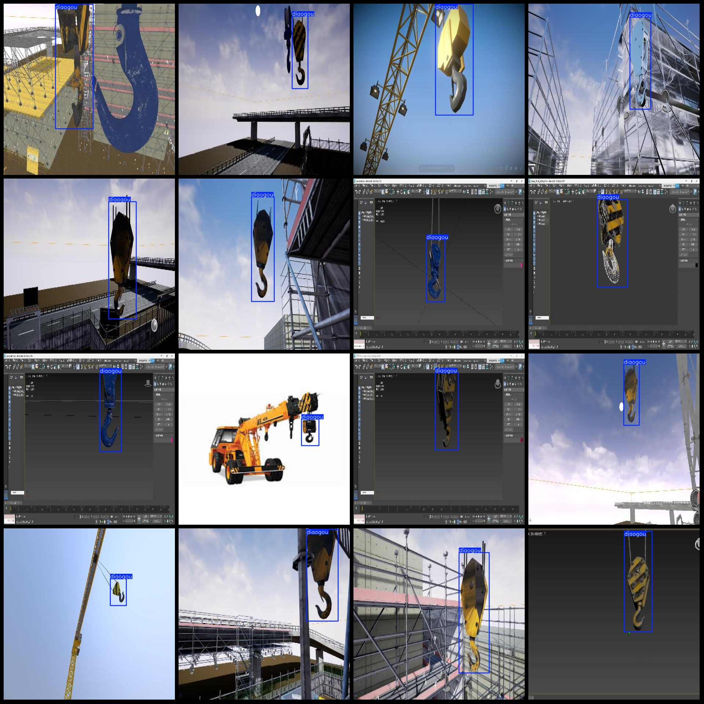

# Smart Construction Crane Hoist Detection Dataset in VOC+YOLO format with 1 category, 1138 images

The dataset format is Pascal VOC format+YOLO format (without the split path in txtfile, only containing jpg image and corresponding VOC format xmlfile and yolo format txtfile).

number of images: 1138

Number of annotations (XML files): 1,138

Number of annotations (txt files): 1138

annotationnumber of classes: 1

["Diaogou"]

The number of boxes labeled in each category:

diaogou box count = 1173

The total number of frames: 1173

Number of images per category:

Diaogoutu occupies the number of pictures = 1138

Image resolution: 640x640

Use labelImg as a labeling tool.

Annotation Rule: Draw a rectangle around the class.

Important notes: The dataset does not have a separate training, validation, and test set.

Special Notice: This dataset does not guarantee the accuracy of the trained model or weight files.

Image preview:
## Images

Here is a pay link on Stripe ( https://buy.stripe.com/3cs8yP7sY87d0vu9AB ). Please contact me lonlonago@foxmail.com after funding $89, and I will send you a complete data files , thank you!

